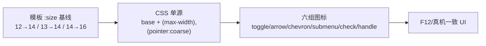

# 2026-10-10 图层浮层全部图标修复 → V3.6.9

## 日期与时间

2026-10-10（会话内执行）

## 任务等级

**L2 常规**（Bug 修复扫尾：V3.6.8 未覆盖的剩余 10 处图标 + 文档/版本号/门禁；依据 Force_command §1）

> 依据 Force_command §0：用户指令「全部修复啊」（P1）要求遵循本规范（P2），无冲突。

## 问题分析

### 核心症状

- 用户指认 `drag-handle`（`GripVertical :size="12"`，`292-301`）在 V3.6.8 后依然小：属实，V3.6.8 范围仅面板头 `Layers/X` + `Eye`，其余 10 处未动。
- 举一反三：主行 HD/选择箭头、年份 `ChevronRight`、控制行 `Layers/Grid/RotateCcw`、加载 `Check`、子菜单箭头、`GripVertical` 全部仍是“模板 `:size` 为王、CSS 无基线、无粗指针覆盖”，F12/真机必继续分叉。

### 根本原因

1. V3.6.8 只统一了 4 处（头/眼），剩余 10 处（5×12、2×13、3×14）沿用旧双源：`12px` 箭头类在高 dpi 下最显小；`Grip 12px` 连桌面基线都不够。
2. `.icon-toggle/.dropdown-arrow/.year-chevron/.submenu-arrow/.custom-url-btn/.drag-handle` 六组选择器无桌面基线锁定，粗指针/窄屏放大在 V3.6.8 只覆盖了头/眼两组。
3. `drag-handle` 按设计 `v-if="!isTouchDevice"` 移动端不渲染（排序靠长按菜单置顶/置底），但桌面/F12 下 12px 仍小；`.drag-handle.mobile-hint` 为死样式（模板无引用），本次不动、记遗留。

### 受影响模块

| 模块 | 文件 |
|---|---|
| OL 图层控制浮层全部图标 | `frontend/src/domains/ol/layer/components/LayerControlPanel.vue`（唯一代码文件） |
| 版本文档 SSOT | `README.md`、`Docs/Guide/CHANGELOG.md`、本日志 |

### 候选方案对比

| 方案 | 说明 | 结论 |
|---|---|---|
| A. 只把 `Grip 12→16` | 用户会继续逐个点名（箭头/重置/加载同病） | 否决：头痛医头 |
| B. 模板数值逐个加大 | 判据错位仍在，平板横屏触摸继续小 | 否决：非根本 |
| C. 剩余 10 处按 V3.6.8 同范式收编：模板合理基线 + CSS 单源基线 + 双条件统一放大；`drag-handle` 只修桌面尺寸、不改 `v-if` 行为 | 与 V3.6.8 同源对齐，一次闭环 | **选定** |

### 选定方案与理由

方案 C：顺序先 `14→16` 再 `12→14`、`13→14`（避免 replaceAll 误伤新值）；`drag-handle` 行为不变（移动端仍隐藏），只修桌面观感，不做触摸拖拽新功能（那是 L3 范畴）。

## 修改内容

1. **模板基线**（10 处）：`12→14`（`ChevronDown` 下拉箭头、`ChevronRight×2` 年份、`GripVertical` 手柄、`ChevronRight` 子菜单箭头）；`13→14`（`Grid3x3` 经纬线、`RotateCcw` 重置）；`14→16`（`ImageIcon` HD、`Layers` 控制行、`Check` 加载）。
2. **CSS 基线（全指针）**：新增 `.icon-toggle svg{16px}`、`.dropdown-arrow/.year-chevron/.submenu-arrow{14px}`、`.custom-url-btn svg{16px}`、`.drag-handle{inline-flex}+svg{14px}`，尺寸单源落在 CSS。
3. **双条件放大**：扩展 `@media (max-width:768px),(pointer:coarse)`：`.icon-toggle{30px}/svg{19px}`、三箭头 `16px`、`custom-url-btn svg{18px}`；`drag-handle` 不进该块（桌面专属）。
4. **文档**：README 三处 → V3.6.9；CHANGELOG 顶部条目；本日志。

## 修改原因

用户明确要求全部修复；V3.6.8 范围声明在先，本次按 §2.5 不扩权、正式立项收编剩余图标。

## 影响范围

- OL 底图切换器全图标（含桌面端轻微变大：12 类→14、控制行 13-14→16 渲染、Grip 12→14）
- `drag-handle` 移动端仍不渲染（行为未变）；触摸拖拽排序未实现，不属本次
- 版本文档 SSOT

## 解决方案

见「修改内容」。与 V3.6.8 同范式：模板只留合理兜底、真实尺寸 CSS 说了算、触摸样式与 `isTouchDevice` 同源。

## 性能指标

未实测（纯尺寸样式）。

## 测试方案

### Agent 已执行

- 全量核对 14 处 `:size`（4 处 V3.6.8 已 16，剩余 10 处逐组定基线）
- 通读六组选择器 CSS 现状（`icon-toggle/dropdown-arrow/year-chevron/submenu-arrow/custom-url-btn/drag-handle`）
- 实施代码修复（模板 10 处基线按序收编 + 六组 CSS 单源 + 双条件扩展）并回读核验（14 处 `:size` 全为 14/16，无 12/13/15 残留）
- 文档更新：README×3（→V3.6.9）、CHANGELOG（V3.6.9 条目）、本日志门禁结果回填

### 待用户实机验证

1. 硬刷新确认 V3.6.9；桌面：手柄约 14px 清晰、箭头不糊、控制行图标与文字协调
2. 真机竖屏：主行 HD/管理/经纬线钮约 30px、图标约 19px；下拉/年份/子菜单箭头约 16px；加载勾约 18px
3. F12 窄屏（触摸开/关）与真机观感一致；平板横屏触摸仍为放大态
4. 移动端图层行仍无手柄（设计如此），排序用长按菜单置顶/置底

## 变更文件清单

| 路径 | 说明 |
|---|---|
| `frontend/src/domains/ol/layer/components/LayerControlPanel.vue` | 剩余 10 处基线 + 六组 CSS 单源 + 双条件扩展 |
| `README.md` | 三处版本 → V3.6.9 |
| `Docs/Guide/CHANGELOG.md` | V3.6.9 条目 |
| `Docs/LLM_record/26-10/2026-10-10/2026-10-10-fix-all-layer-icons.md` | 本日志 |

> 本次无新增/删除源码文件 → `frontend-structure.md` 无需增删条目。

## 模块关系

## 遗留与风险

- `.drag-handle.mobile-hint` 死样式仍在，未删（删也是一行，但为最小 diff 保留；下次顺手清）。
- 桌面端图标整体大 1-3px，若用户觉得控制行太重，可回调 `.icon-toggle svg 16→15px`，仅改一行。
- `drag-handle` 触摸拖拽排序仍未实现；如需移动端拖拽，属新功能另立 L2/L3（先记 TODO，今回复未立项）。
- 未实机运行，需用户按上条验证。

## 门禁

- `python Scripts/CheckStructureTree.py`：通过（482 项/0 漂移；本次无源码增删，`frontend-structure.md` 无需动）
- `python Scripts/CheckConfigRegistry.py`：全部通过 ✅（本次无配置 key）
- 平台红线自查：本次仅动 `frontend/.../LayerControlPanel.vue`（CSS/图标属性），未碰后端/部署面；对改动目录等效 Grep（自动化/代理/keepalive 三组）无命中 → CLEAN；`deploy/.env` 生产基线未动（V3.6.8 已验）
- 未执行任何 Git 写操作
