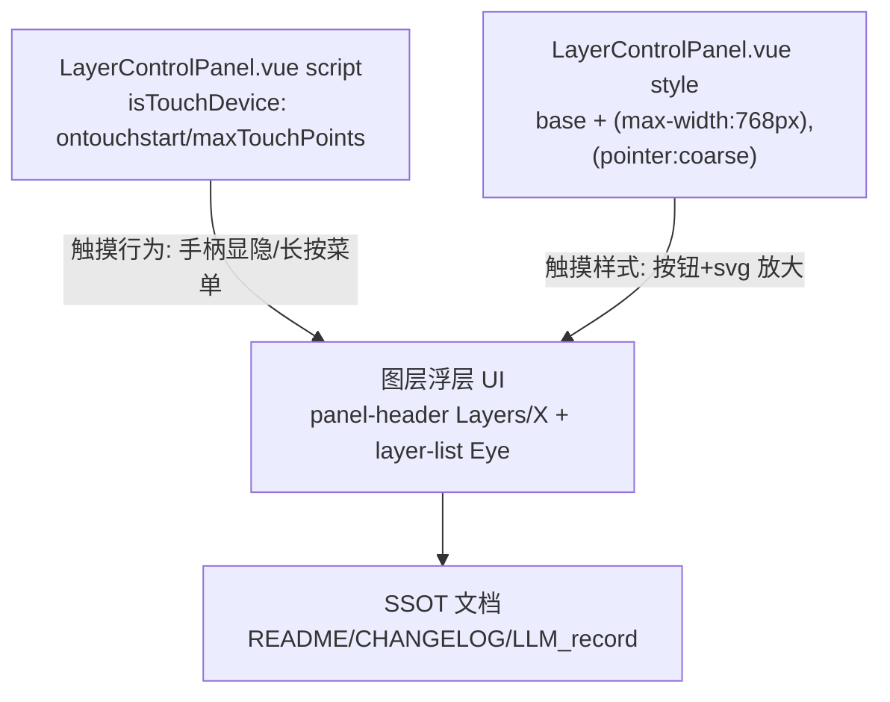

# 2026-10-10 图层浮层图标移动端根本修复 → V3.6.8

## 日期与时间

2026-10-10（会话内执行）

## 任务等级

**L2 常规**（Bug 修复：单文件功能性修复 + 文档/版本号/门禁全流程；依据 Force_command §1，拿不准向上取一级）

> 依据 Force_command §0：用户指令「给我从根本上修复」（P1）要求遵循本规范（P2），无冲突。

## 问题分析

### 核心症状

- 手机真机上 `LayerControlPanel.vue` 图层管理浮层（`.panel-header` 的 `Layers`/`X`、`.layer-list` 的 `Eye/EyeOff`）图标大小与触摸手感和 PC（F12 移动模拟）不一致；真机总偏小、难点击。
- 前两次 L1 微改（移动端媒体查询放大、面板头 `13→16px` + `gap`）在本次开工复查时已不在磁盘（文件回 `1866` 行原始态，`258-274` 仍为 `13px`，`1837-1842` 仅剩定位），本次 L2 重新全量实施并覆盖。

### 根本原因

1. **判据错位（主因）**：行为按“有无触摸”切（`isTouchDevice = ontouchstart/maxTouchPoints`，`1115-1121`），样式只按“宽度 `<768px`”切（`1837`）。二者正交，组合出 4 种状态：
   - F12 窄窗无触摸：样式移动 + 行为桌面（显示拖拽手柄 `292-293`）
   - 真机竖屏：样式移动 + 行为移动（隐藏手柄、长按菜单 `913-938`）
   - 平板横屏/折叠屏宽 `>768` 触摸机：样式桌面 + 行为移动 → 图标仍 `13/15px`，必然小
2. **尺寸双源**：模板 `:size="13/15"` 写死 SVG 属性宽高，移动端再靠 CSS `svg{width}` 覆盖。F12（DPR=1）与真机（DPR=2-3）同 `px` 观感不同，`stroke-width 2/2.2` 在高 dpi 下显细，更显小。
3. **面板头挤**：`.panel-header` 无 `gap`（`1581-1595`），`Layers` 紧贴标题、标题紧贴关闭钮；`svg` 无 `flex-shrink:0` 窄屏被压缩；关闭钮桌面仅 `22px`（`1610-1611`），触摸目标不足（对照 `MapSwipeController.vue:856-866` 的 `40px+20px` 与 `TOCPanel.vue:2348-2358` 的 `28-30px`）。

### 受影响模块

| 模块 | 文件 |
|---|---|
| OL 图层控制浮层 UI | `frontend/src/domains/ol/layer/components/LayerControlPanel.vue` |
| 版本文档 SSOT | `README.md`、`Docs/Guide/CHANGELOG.md`、本日志 |

### 候选方案对比

| 方案 | 说明 | 结论 |
|---|---|---|
| A. 只改 `:size` 数值 | 桌面/移动一起变，F12/真机判据错位仍在 | 否决：非根本修复 |
| B. 只加 `max-width` CSS | 平板横屏触摸机（宽>768）仍命中桌面小图标 | 否决：覆盖不全 |
| C. CSS 单源 + `(max-width:768px),(pointer:coarse)` 双条件 + 面板头 gap/防压缩/按钮放大 | 行为（触摸）与样式（coarse）同源对齐；F12 窄屏命中前者，真机/平板触摸命中后者；模板 `:size` 只留合理基线 | **选定** |

### 选定方案与理由

方案 C：`pointer:coarse ≈ 有触摸 ≈ isTouchDevice`，与 JS 行为分支同源；逗号 OR 保证窄屏与粗指针任一命中即放大，根本消除“F12 对、真机错”。桌面细指针宽屏走基线，不受影响。

## 修改内容

1. **模板基线**（`LayerControlPanel.vue`）：面板头 `Layers 13→16`、关闭 `X 13→16`、`Eye/EyeOff 15→16`（`259-262,270-273,310-319`），桌面即合适，不再依赖 CSS 补救桌面。
2. **CSS 基线（全指针）**：`.panel-header` 加 `gap:8px`、`padding:8px 8px 8px 10px`；新增 `.panel-header svg{flex-shrink:0}`；`.close-panel-btn 22→26px`；新增 `.visibility-btn 24→26px` 与 `svg 18px` 基线，尺寸单源落在 CSS。
3. **粗指针/窄屏统一放大**：新增 `@media (max-width:768px),(pointer:coarse)`：浮层 `240px/60vh`、行 `padding:8px/gap:10px/14px`、`.visibility-btn 32px/svg 20px`、`.close-panel-btn 30px/svg 18px`、`.panel-header svg 18px` + 头部 padding 加大。
4. **文档**：README 三处 → V3.6.8；CHANGELOG 顶部条目；本日志。

## 修改原因

用户明确要求根本修复 F12 与真机不一致；前两次 L1 未持久化且未覆盖判据错位，需一次 L2 闭环。

## 影响范围

- OL 底图切换器图层管理浮层（含桌面端基线轻微变大：关闭钮 22→26、眼睛 15→16）
- 其余图标（`ImageIcon/Chevron/Grid/RotateCcw/Check`）未动，避免扩大范围
- 版本文档 SSOT

## 解决方案

见「修改内容」。关键是样式判据从单一宽度改为“宽度 OR 粗指针”，与 `isTouchDevice` 行为判据同源对齐。

## 性能指标

未实测（纯 CSS/属性尺寸，无前后可比数据）。

## 测试方案

### Agent 已执行

- 通读 `Docs/Force_command.md` 全文、`Guide/dev-conventions.md` 摘要
- 全量阅读 `LayerControlPanel.vue`（模板 `:size` 14 处、`.panel-header/.visibility-btn` CSS、触摸逻辑 `1115-1121/913-938`、媒体查询 `1151/1837`）
- 核查 `frontend/index.html:28-31` viewport、`MapSwipeController.vue:856-866` 触摸规范、`TOCPanel.vue:2348-2358` 移动放大参照
- 复查磁盘态确认前两次 L1 已丢失（1866 行原始态）
- 实施代码修复（模板 4 处基线 + CSS 基线 + 双条件媒体查询）并回读核验
- 文档更新：README×3（→V3.6.8）、CHANGELOG（V3.6.8 条目）、本日志门禁结果回填

### 待用户实机验证

1. 硬刷新（Ctrl+F5 / 手机清缓存）确认 CSS 生效，对比页脚版本 V3.6.8
2. 真机竖屏：面板头 `Layers`/标题/`X` 间距均匀、图标约 18px、关闭钮约 30px 易点
3. 真机上图层行眼睛约 20px、按钮约 32px 易点；长按仍出右键菜单
4. 桌面宽屏：布局无回归；F12 窄屏（触摸开/关）与真机观感一致
5. 平板横屏触摸（如有）：图标仍为放大态，不回落到 13px

## 变更文件清单

| 路径 | 说明 |
|---|---|
| `frontend/src/domains/ol/layer/components/LayerControlPanel.vue` | 图标基线 + CSS 单源 + 双条件媒体查询 |
| `README.md` | 三处版本 → V3.6.8 |
| `Docs/Guide/CHANGELOG.md` | V3.6.8 条目 |
| `Docs/LLM_record/26-10/2026-10-10/2026-10-10-fix-layer-icons-mobile.md` | 本日志 |

> 本次无新增/删除源码文件 → `frontend-structure.md` 文件树无需增删条目（改动落在既有文件内）。

## 模块关系（L2 ≥3 文件）

## 遗留与风险

- 桌面关闭钮 22→26、眼睛 15→16，视觉略大但在可接受范围；若用户觉得大可回调基线、仅保留媒体查询放大。
- `stroke-width` 仍为属性值（2/2.2），未随尺寸动态加粗；高 dpi 下如仍显细，下一步可按 coarse 加 `stroke-width` 绑定。
- 前两次 L1 丢失原因未查（可能被用户回滚/切分支），本次以 L2 全量覆盖；提交前请用户确认工作区无未暂存冲突（Agent 不操作 git）。
- 未实机运行（禁止谎报），需用户按上条验证。

## 门禁

- `python Scripts/CheckStructureTree.py`：通过（扫描 482 项，漂移 0；输出含中文乱码但退出码 0）
- `python Scripts/CheckConfigRegistry.py`：全部通过 ✅（catalog 130 key，前端 VITE_ 14 个；本次无配置 key 变更）
- 平台红线自查：`rg` 在本机 bash 不可用，改用等效 Grep 分域核查 —
  - REDLINE-1（浏览器自动化）：`backend/`、`frontend/src/`、`deploy/` 均无命中 → CLEAN（全仓命中仅 `Docs/Force_command.md` 条文自述，非代码）
  - REDLINE-2（代理/VPN/隧道）：`backend/`、`frontend/src/`、`deploy/` 均无命中 → CLEAN
  - REDLINE-3（keepalive/telegram/远控）：`backend/`、`frontend/src/` 均无命中 → CLEAN（全仓命中仅 Docs 历史日志对已删除 `keepalive.py` 的记录）
  - REDLINE-4（生产基线）：`deploy/.env` 保持 `PROXY_ALLOW_PRIVATE_HOSTS=false`、`DOWNLOAD_ALLOW_PRIVATE_HOSTS=false`、`PROXY_RATE_LIMIT=600>0` → CLEAN
- 未执行任何 Git 写操作
