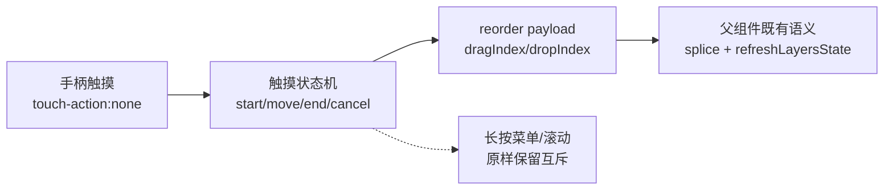

# 2026-10-10 图层触摸拖拽排序真实现 → V3.6.10

## 日期与时间

2026-10-10（会话内执行）

## 任务等级

**L2 常规**（新功能：移动端触摸拖拽排序 + 文档/版本号/门禁；依据 Force_command §1，单组件内实现，不属 L3 架构级）

> 依据 Force_command §0：用户指令「给我真实现啊」（P1）要求遵循本规范（P2），无冲突。

## 问题分析

### 核心症状

- 移动端图层行没有拖拽手柄（`v-if="!isTouchDevice"` 按设计隐藏），触摸排序只能靠长按菜单逐级置顶/置底，多图层连续排序极繁琐。

### 根本原因

1. 手柄渲染与桌面 HTML5 DnD 强绑定（`:draggable="!isTouchDevice"` + `dragstart/drop`），触摸侧从未实现等价路径，只做了长按菜单（`onLayerTouchStart 913` + 500ms 计时）。
2. 若只拿掉 `v-if` 假显示，手柄点了拖不动——必须补触摸拖拽状态机，且与长按菜单、列表滚动三者互斥。

### 受影响模块

| 模块 | 文件 |
|---|---|
| OL 图层控制浮层交互 | `frontend/src/domains/ol/layer/components/LayerControlPanel.vue`（唯一代码文件） |
| 排序语义（复用，不改） | `frontend/src/domains/ol/layer/composables/useLayerControlHandlers.js:517-530`（`splice(drag)→splice(drop)`，`dropIndex` 须为有效下标且≠dragIndex） |
| 版本文档 SSOT | `README.md`、`Docs/Guide/CHANGELOG.md`、本日志 |

### 候选方案对比

| 方案 | 说明 | 结论 |
|---|---|---|
| A. 拿掉 `v-if` 了事 | 手柄可见但不可拖，假 UI | 否决 |
| B. 整行触摸即拖 | 与列表滚动、长按菜单三方冲突，误触率高 | 否决 |
| C. 手柄发起式触摸拖拽：手柄常显（F12/真机一致），按住手柄滑动才进拖拽；行内其他区域保留滚动+长按菜单；落点发与桌面同形 `reorder` payload | 冲突面最小、可发现性强 | **选定** |

### 选定方案与理由

方案 C：手柄是天然拖拽语义锚点（`touch-action:none` 仅锁手柄，行内其余区域照常滚动）；复用 `draggingIndex` 的 `.dragging` 视觉 + 父组件既有 `reorder` 语义，零协议新增。

## 修改内容

1. **模板**：手柄 `span` 去掉 `v-if`（F12/真机/桌面三端常显）；`.layer-list` 加 `ref="layerListRef"`；行 `class` 加 `touch-drop-target` 落点指示；加 `@touchcancel` 兜底。
2. **脚本**：新增 `touchDragActive/touchDragIndex/touchDropIndex/layerListRef` + `updateTouchDropIndex()`（按行中点算落点，钳制为有效下标）；`onLayerTouchStart` 命中手柄进拖拽（不清长按计时改走拖拽）；`onLayerTouchMove` 拖拽中 `preventDefault` + 更新落点；`onLayerTouchEnd/Cancel` 提交或重置（提交 payload 与桌面 `onDrop` 同形）。
3. **样式**：`.drag-handle{touch-action:none}`；`.touch-drop-target` 顶部插入线；粗指针下手柄 `svg 18px`。
4. **文档**：README 三处 → V3.6.10；CHANGELOG 顶部条目；本日志。

## 修改原因

用户明确要求真实现移动端拖拽排序；此前三端手柄显隐不一（桌面有/手机无）亦在这次一并拉齐。

## 影响范围

- OL 图层管理浮层：桌面 DnD 原样；触摸新增手柄拖拽；长按菜单、显隐、透明度、置顶/置底均不动
- 排序结果走既有 `reorder` 通道，父组件逻辑零改

## 解决方案

见「修改内容」。互斥规则：单指+起点在手柄+位移>10px=拖拽；单指+起点在行内+静止500ms=菜单；行内滑动=滚动；多指=全部取消。

## 性能指标

未实测（手势交互，无前后可比数据）。

## 测试方案

### Agent 已执行

- 核对父组件 `reorder` 语义（`useLayerControlHandlers.js:517-530`）
- 全量通读本组件触摸三件套与桌面 DnD（`808-835` + `900-966`）及模板行结构（`276-301`）
- 实施：手柄常显 + 触摸拖拽状态机 + 指示样式，并回读核验（`v-if` 已移除，状态/样式 18 处命中）
- 文档更新：README×3（→V3.6.10）、CHANGELOG（V3.6.10 条目）、本日志门禁结果回填

### 待用户实机验证（真机，F12 不能代替手势）

1. 硬刷新确认 V3.6.10；图层行行首出现手柄（桌面/手机一致）
2. 按住手柄上下滑：被拖行半透明，目标位置出现顶部插入线；松手后顺序真的换了且 zIndex 联动（地图叠放变化）
3. 行内其他区域上下滑：列表照常滚动，不触发拖拽
4. 行内长按 500ms：仍出右键菜单（URL/透明度/置顶置底），拖拽后不再误弹菜单
5. 桌面端鼠标拖拽：原样可用，无回归

## 变更文件清单

| 路径 | 说明 |
|---|---|
| `frontend/src/domains/ol/layer/components/LayerControlPanel.vue` | 手柄常显 + 触摸拖拽状态机 + 指示样式 |
| `README.md` | 三处版本 → V3.6.10 |
| `Docs/Guide/CHANGELOG.md` | V3.6.10 条目 |
| `Docs/LLM_record/26-10/2026-10-10/2026-10-10-touch-drag-sort.md` | 本日志 |

> 本次无新增/删除源码文件 → `frontend-structure.md` 无需增删条目。

## 模块关系

## 遗留与风险

- 触摸拖拽无自动滚动：列表超长需拖到可视区内分段挪；如需长列表连拖，另立项做边缘自动滚动。
- `touchmove` 内 `preventDefault` 仅在拖拽激活时调用，不影响正常滚动；若个别浏览器把行级监听当 passive 处理并告警，可再加 `.passive` 拆分（本次未实机，未预设）。
- `.drag-handle.mobile-hint` 死样式仍在，未删。
- 未实机运行，需用户按上条真机验证。

## 门禁

- `python Scripts/CheckStructureTree.py`：通过（482 项/0 漂移；本次无源码增删，`frontend-structure.md` 无需动）
- `python Scripts/CheckConfigRegistry.py`：全部通过 ✅（本次无配置 key；catalog 130 key / 前端 VITE_ 14 个）
- 平台红线自查：本次仅动前端单组件（模板手势+CSS），未碰后端/部署面；改动目录等效 Grep 三组无命中 → CLEAN；`deploy/.env` 未动
- 未执行任何 Git 写操作
