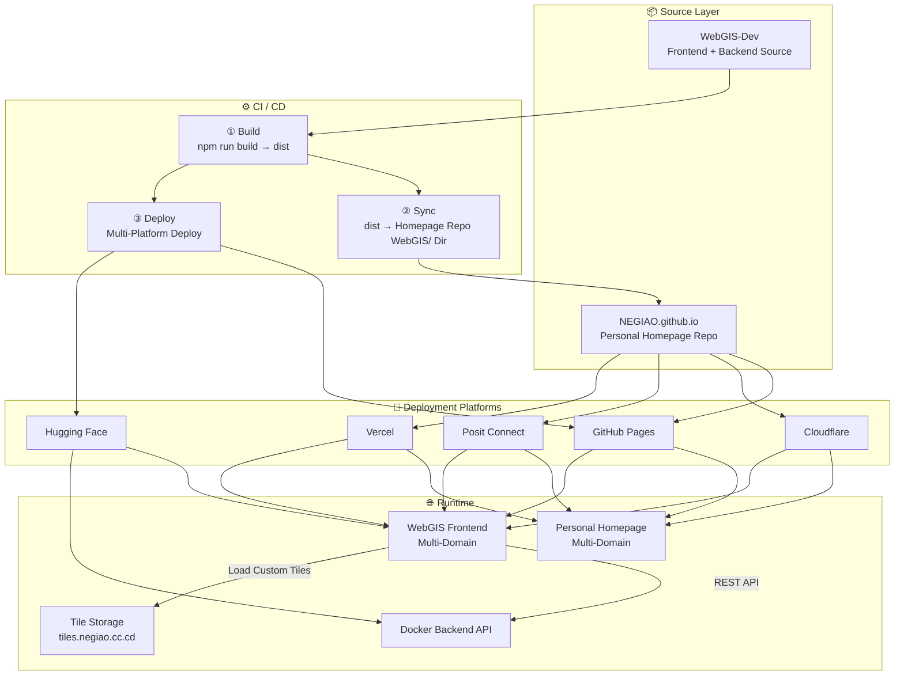

<p align="center">
  <a href="../README.md">🇨🇳 中文</a> | <a href="./README_EN.md">🇬🇧 English</a>
</p>

<h1 align="center">NEGIAO's WebGIS</h1>

<p align="center">
  <em>Professional Full-Stack WebGIS Platform · Vue 3 + OpenLayers + Cesium + FastAPI</em>
</p>

<p align="center">
  <a href="https://vuejs.org/"></a>
  <a href="https://fastapi.tiangolo.com/"></a>
  <a href="https://openlayers.org/"></a>
  <a href="https://cesium.com/"></a>
  <a href="https://pages.github.com/"></a>
  <a href="https://www.docker.com/"></a>
  <a href="https://huggingface.co/"></a>
  <a href="#-license"></a>
</p>

<p align="center">
  🚀 <strong>Live Demo</strong>: <a href="https://negiao.github.io/WebGIS-Dev/">NEGIAO's WebGIS-Dev — Click to Explore</a>
</p>

<p align="center">
  
  
  
  
</p>

---

## 🌟 Core Features Preview

<div align="center">

| **🗺️ Basemap Swipe Comparison** | **🧭 Fengshui Compass** |
| :---: | :---: |
| <a href="https://github.com/user-attachments/assets/c8cb6f16-04e0-4b9a-983f-22538e0bd65a"></a> | <a href="https://github.com/user-attachments/assets/acbb5a56-bff7-44c3-848b-dbe178c52301"></a> |
| **📐 2D Data Management** | **☁️ 3D Roaming & Cloudscape** |
| <a href="https://github.com/user-attachments/assets/91322c8a-bff5-4fcc-b0d4-fdf3924970ff"></a> | <a href="https://github.com/user-attachments/assets/7bedba67-d965-4640-ac32-f5d75630e434"></a> |
| **🤖 AI Assistant Interaction** | **🌊 Dynamic Flood Analysis** |
| <a href="https://github.com/user-attachments/assets/2dbbb794-ef3e-4d7a-b16b-4f381053fec3"></a> | <a href="https://github.com/user-attachments/assets/e26761db-8f91-4f05-90f2-106b28223ab5"></a> |

</div>

---

## 📑 Table of Contents

- [🌟 Core Features Preview](#-core-features-preview)
- [📑 Table of Contents](#-table-of-contents)
- [🎯 Project Overview](#-project-overview)
  - [Core Capabilities](#core-capabilities)
- [🚀 Quick Start](#-quick-start)
  - [Prerequisites](#prerequisites)
  - [Configuration (Dual env File Architecture, Read This First)](#configuration-dual-env-file-architecture-read-this-first)
  - [One-Click Launch (Recommended)](#one-click-launch-recommended)
  - [Manual Launch (Advanced Users)](#manual-launch-advanced-users)
- [📁 Project Structure](#-project-structure)
- [🏗️ System Architecture](#️-system-architecture)
  - [Layered Architecture Overview](#layered-architecture-overview)
  - [Domain Mapping](#domain-mapping)
- [🧭 Documentation Navigation](#-documentation-navigation)
  - [Development Docs](#development-docs)
  - [Architecture Docs](#architecture-docs)
    - [System-Level Architecture](#system-level-architecture)
    - [Feature Architecture](#feature-architecture)
- [📜 Version History](#-version-history)
- [📄 License](#-license)
- [👤 Author \& Hosting](#-author--hosting)

---

## 🎯 Project Overview

**NEGIAO's WebGIS** is a full-featured, cleanly architected full-stack WebGIS platform (current version V3.5.22). The frontend is hosted on GitHub Pages, the backend is deployed via Docker on Hugging Face Spaces, and the two communicate through RESTful APIs with support for independent scaling.

> 📚 This README retains only the core overview and navigation. Full documentation has been modularized into [`Docs/Guide/`](Docs/Guide/), see "Documentation Navigation" below.
>
> 📐 Architecture docs are centralized in [`Docs/Architecture/`](Docs/Architecture/), using Mermaid flowcharts / sequence diagrams / state diagrams to describe module relationships, data flow, and file interactions of each subsystem — for technical handover and design review. Each architecture doc focuses on one functional domain, covering design decisions, implementation details, and upgrade directions.
>
> Want to understand the project quickly? Try [DeepWiki — Ask an LLM about this project](https://deepwiki.com/NEGIAO/WebGIS-Dev) [](https://deepwiki.com/NEGIAO/WebGIS-Dev)

### Core Capabilities

| Domain | Description |
|------|------|
| 🗺️ 2D/3D Dual Engine | OpenLayers 2D + Cesium 3D one-click switch, bidirectional view state sync, URL share & restore |
| 🌐 Rich Basemap Sources | 20+ tile sources, circuit-breaker fallback, GCJ-02 rectification, custom XYZ integration |
| 📥 Multi-Format Data Import | GeoJSON / KML / SHP / GLB / CZML / 3D Tiles drag-and-drop loading, 2D/3D dual pipeline |
| 📐 Spatial Analysis | Buffer / Overlay / Voronoi / Cluster / Fishnet and 8 more operators (Shapely backend for precise computation) |
| ✨ 3D Effects | Volumetric cloud ray marching, Bruneton atmosphere, BSM cloud shadows, wind field particles, flood simulation |
| 🛣️ Route Planning | Tianditu driving/transit dual pipeline, search point selection & route rendering |
| 🤖 AI Spatial Assistant | LLM integration with three access modes (Default / Personal Key / Backend Proxy) |
| 🔐 Account System | Email sign-up & login, Google/GitHub one-click sign-up/login & binding, three-tier roles, session auth, dual AI quota management |
| 🧰 Utility Tools | Measurement, coordinate picking, fengshui compass, swipe analysis, weather, theme switching, layer management |

---

## 🚀 Quick Start

### Prerequisites

| Dependency | Purpose |
|------|------|
| Node.js 16+ | Frontend build & dev server |
| Docker Desktop | Containerized backend environment (**required**) |
| LocalDev.bat | Windows one-click launch script (recommended) |

### Configuration (Dual env File Architecture, Read This First)

| File | git Status | Purpose | Read Timing | `APP_ENV` |
|------|----------|------|----------|-----------|
| **`.env`** | **git tracked** | Deployment environment (production baseline) | `npm run build` + online deployment | `production` |
| **`.env.local`** | **git tracked** | Local development (overrides `.env`) | `npm run dev` + local backend | `development` |
| `.env.example` | git tracked | Full key catalog (no real values) | — | — |

**Three-tier secret classification** (L1/L2/L3):

| Tier | Location | Purpose |
|----|--------|--------|
| **L1** | Root `.env` / `.env.local` (non-sensitive) | URLs, ports, frontend `VITE_*`, public endpoints / timeouts |
| **L2** | Admin panel + Database | Map tokens, Agent/LLM keys & params, basemaps, announcements (frequently changed, hot-reloaded) |
| **L3** | HuggingFace **Secrets** | Top secret: `SUPER_USER`, OAuth secrets, SMTP passwords, Supabase keys, monitoring tokens |

Explanation & checklist: [Docs/Guide/configuration.md](Docs/Guide/configuration.md) · Execution plan: [configuration-architecture-plan.md](Docs/Guide/configuration-architecture-plan.md)

```bash
# Repository root: .env (deployment) and .env.local (local development) dual-file architecture
# Both files are committed to git (L1 is non-sensitive)
# Local development: Vite reads .env.local, backend reads .env.local (overrides production values with localhost)
# Production build: Vite only reads .env (selectiveEnvPlugin picks one based on mode)
```

### One-Click Launch (Recommended)

```bash
# Windows: Double-click LocalDev.bat, the script automatically:
# 1. Detect environment dependencies (Node.js / Docker / docker compose)
# 2. Local dev environment: frontend Vite reads .env.local, backend load.py reads .env.local (overrides to localhost dev values)
# 3. Smart Docker image status detection (first build / code hot-reload / Dockerfile change prompt)
# 4. Start frontend dev server → http://localhost:5173
# 5. Auto-open browser
```

> `LocalDev.bat` is pure ASCII encoded, compatible with GBK/UTF-8 systems; Chinese color output is provided by `Write-Color.ps1` in the same directory.

**Access URLs**: Frontend http://localhost:5173 · Backend API docs http://localhost:7860/docs

### Manual Launch (Advanced Users)

<details>
<summary><strong>Frontend Local Development</strong></summary>

```bash
cd frontend
npm install
npm run dev
# → http://localhost:5173
```

</details>

<details>
<summary><strong>Backend (Docker Compose)</strong></summary>

```bash
# First run requires --build to build the image (large file, wait a few minutes)
docker-compose up --build

# Subsequent runs
docker-compose up
# → http://localhost:7860/docs
```

> The backend has been upgraded to Docker Compose containerized deployment; direct `uvicorn` execution is no longer supported.

</details>

<details>
<summary><strong>Production Deployment</strong></summary>

```bash
# Launch frontend and backend together
docker-compose up

# Or build backend image separately
cd backend
docker build -t webgis-backend .
```

</details>

---

## 📁 Project Structure

Directory trees are maintained in [`Docs/Guide/`](Docs/Guide/) (atomic, not duplicated in README):

- [Project root directory overview + Docs tree](Docs/Guide/project-structure.md)
- [Frontend complete file tree `frontend/src/`](Docs/Guide/frontend-structure.md)
- [Backend complete file tree `backend/`](Docs/Guide/backend-structure.md)

---

## 🏗️ System Architecture

> Full architecture docs have been modularized into [`Docs/Architecture/`](Docs/Architecture/):
> [System Architecture Overview](Docs/Architecture/system-architecture.md) · [CI/CD Pipeline](Docs/Architecture/cicd-pipeline.md) · [Deployment Relationships & Domain Mapping](Docs/Architecture/deployment-relationship.md)

### Layered Architecture Overview



### Domain Mapping

**Personal Homepage:**

| Domain | Platform | CDN | China Access |
|------|------|-----|----------|
| `negiao.github.io` | GitHub Pages default | ❌ | ⚠️ Unstable |
| `negiao.cloud-ip.cc` | GitHub Pages + custom domain | ✅ Configurable | ✅ Accessible |
| `negiao.cc.cd` | Cloudflare Pages | ✅ Cloudflare | ❌ Blocked |
| `negiao.pages.dev` | Cloudflare Pages default | ✅ Cloudflare | ✅ Smooth |
| `negiao-pages.share.connect.posit.cloud` | Posit Connect | ❌ | ✅ Accessible |
| `negiao.vercel.app` | Vercel | ❌ | ❌ Inaccessible |

**WebGIS Frontend:**

| Domain | Platform | Source |
|------|------|------|
| `negiao.github.io/WebGIS-Dev` | GitHub Pages | WebGIS-Dev repo root path |
| `negiao.github.io/WebGIS` | GitHub Pages | Homepage repo subdirectory |
| `negiao.cloud-ip.cc/WebGIS-Dev` | GitHub Pages + custom domain | Auto redirect |
| `webgis.negiao.cc.cd` | Cloudflare Pages | Private domain mount |
| `webgis-dev.pages.dev` | Cloudflare Pages default | Auto assigned |
| `negiao-webgis.share.connect.posit.cloud` | Posit Connect | Homepage repo trigger |
| `negiao-web.static.hf.space` | Hugging Face Static | Direct push |

**Backend & Storage:**

| Component | Domain | Platform |
|------|------|------|
| Backend API | `negiao-webgis.hf.space` | Hugging Face Docker |
| Tile Storage | `tiles.negiao.cc.cd` | Cloudflare R2 |

> Full domain list, deployment source matrix, and platform capability comparison: [deployment-relationship.md](Docs/Architecture/deployment-relationship.md)

---

## 🧭 Documentation Navigation

### Development Docs

| Document | Content |
|------|------|
| [Project Structure Guide](Docs/Guide/project-structure.md) | Complete directory tree and module responsibility descriptions |
| [Handover Document](Docs/Guide/handover.md) | Must-read for new developers: doc map, three architecture quick references, code coordinates, gatekeeping process & pitfall list |
| [Development Conventions](Docs/Guide/dev-conventions.md) | Mandatory rules, layered boundaries, coordinate system conventions, pre-commit checks |
| [Dev Guide & Contribution Guide](Docs/Guide/dev-guide.md) | Standard process for adding pages/API, frontend-backend communication, code style |
| [Tech Stack & FAQ](Docs/Guide/faq.md) | Frontend & backend tech stack, reference resources, FAQ, TODO |
| [Changelog](Docs/Guide/CHANGELOG.md) | Complete version history |
| [Configuration Guide](Docs/Guide/configuration.md) | Three-tier configuration (root .env / Admin+DB / HF Secrets) |
| [Configuration Architecture Plan](Docs/Guide/configuration-architecture-plan.md) | Phased roadmap for consolidating configuration |
| [OAuth Deployment Guide](Docs/Guide/oauth-deployment.md) | Google/GitHub/Hugging Face login: console application, HF Secrets config, acceptance & troubleshooting workflow |

### Architecture Docs

Architecture descriptions for eight core features are centralized in [`Docs/Architecture/`](Docs/Architecture/):

#### System-Level Architecture

| Document | One-Line Description |
|------|-----------|
| [System Architecture Overview](Docs/Architecture/system-architecture.md) | Five-layer architecture: Source → CI/CD → Deployment → Runtime → User |
| [CI/CD Pipeline](Docs/Architecture/cicd-pipeline.md) | Five-job pipeline: Build → Sync → Multi-Deploy details |
| [Deployment Relationships & Domain Mapping](Docs/Architecture/deployment-relationship.md) | Domain list, deployment source matrix, platform capability comparison |

#### Feature Architecture

| Feature | Document | One-Line Description |
|------|------|-----------|
| 2D/3D Dual Engine | [`ol-cesium-dual-engine.md`](Docs/Architecture/ol-cesium-dual-engine.md) | One-click switch, view sync & URL share/restore |
| Rich Basemap Sources | [`basemap-source-system.md`](Docs/Architecture/basemap-source-system.md) | 20+ sources, circuit-breaker fallback, GCJ-02 rectification |
| Multi-Format Data Import | [`multi-format-data-import.md`](Docs/Architecture/multi-format-data-import.md) | Drag-and-drop loading, 2D/3D dual pipeline & blob URL approach |
| Spatial Analysis | [`spatial-analysis-backend.md`](Docs/Architecture/spatial-analysis-backend.md) | Single-endpoint dispatch, Shapely backend 8 operators |
| Route Planning | [`route-planning.md`](Docs/Architecture/route-planning.md) | Driving/transit dual pipeline, search point selection & route rendering |
| 3D Effects | [`cesium-3d-effects.md`](Docs/Architecture/cesium-3d-effects.md) | Volumetric clouds, wind field, shallow water overlay & post-processing |
| Utility Tools | [`utility-tools.md`](Docs/Architecture/utility-tools.md) | Measurement, coordinate picking, compass, sharing, GeoTIFF download |
| Account System | [`account-system-ai-quota.md`](Docs/Architecture/account-system-ai-quota.md) | Email login + Google/GitHub/Hugging Face OAuth, three-tier roles, dual AI quota |
| Flood Simulation | [`cesium-fluid-flood-simulation.md`](Docs/Architecture/cesium-fluid-flood-simulation.md) | GPU fluid pipeline deep dive (3D effects companion) |
| Three-Tier Configuration | [`configuration-three-tier.md`](Docs/Architecture/configuration-three-tier.md) | L1/L2/L3 panorama: source → unified entry → business/frontend consumption & gatekeeping |
| Cesium Unified Layer Management | [`cesium-unified-layer-management.md`](Docs/Architecture/cesium-unified-layer-management.md) | Design review draft: two-step approach for unified 3D data TOC |

---

## 📜 Version History

> Full history in [`CHANGELOG.md`](Docs/Guide/CHANGELOG.md), only recent summaries listed below.

| Version | Date | Summary |
|------|------|------|
| **V3.5.22** | 2026-08-17 | Consolidated version: **first-paint language follows the browser default** (`detectSystemLanguage` SSOT: zh environment → zh-CN, otherwise → en-US; empty/dirty language values unified, user preference & explicit switch still take priority) · **Back-home entries on Register & legal pages** (round home button + clickable brand area on `/register`, dual links on `/terms` `/privacy`) · **Hugging Face OAuth login** (full login/bind/unlink chain + emailVerified exception + official color logo) · **L3 status monitoring automated** (catalog-metadata driven, 9 groups auto-generated in startup log & admin panel) · **Trademark icon normalization** (Google official four-color G + HF official color logo). [Details](Docs/LLM_record/26-08/2026-08-16/2026-08-16-v3.5.22-consolidated.md) |
| **V3.5.21** | 2026-08-16 | Consolidated version: admin panel data table enhancements (**pagination + cross-page search/sort + CSV export + search highlighting + row numbers/range bar**, rows API returns total) · Agent basemap capability unlocked (`switch_basemap` supports **XYZ URL or preset ID** + self-built public sources + **fully derived preset catalog** of 76 items) · new **CyclOSM cycling basemap** · Landing/Register **Lucide icon migration** & OneTap slow-load fix · `.env` OAuth Client ID tier adjustment (production values moved to HF Secrets). [Details](Docs/LLM_record/26-08/2026-08-16/2026-08-16-v3.5.21-consolidated.md) |
| **V3.5.20** | 2026-08-15 | Landing page completed: zh/en switching, icon.webp brand logo, scroll fix (self-holding scroll container) · Register page Landing-style background (lat-lon grid + glow) · **Official domain integration**: webgis.negiao.cn full-chain landing (UI footer entry + README/config defaults synced). [Details 1](Docs/LLM_record/26-08/2026-08-15/2026-08-15-landing-i18n-scroll-background.md) · [Details 2](Docs/LLM_record/26-08/2026-08-15/2026-08-15-official-domain-webgis-negiao-cn.md) |

Earlier versions (V3.5.19 and before) — see [Full Changelog →](Docs/Guide/CHANGELOG.md)

---

## 📄 License

[MIT License](LICENSE) — Free to use, modify, and distribute.

> **Attribution Request**: If you run or deploy this project or any derivative in any public environment (website, server, paper, exhibition, etc.), please inform the author via email yaonaigao@gmail.com or GitHub Issue with your use case.

---

## 👤 Author & Hosting

<div align="center">

**NEGIAO** — [GitHub](https://github.com/NEGIAO) · [DeepWiki Project Analysis](https://deepwiki.com/NEGIAO/WebGIS-Dev)

| Source Code | Frontend Deployment | Backend Deployment |
|:------:|:--------:|:--------:|
| [GitHub](https://github.com/NEGIAO/WebGIS-Dev) | [GitHub Pages](https://negiao.github.io/WebGIS-Dev/) | [Hugging Face](https://NEGIAO-WebGIS.hf.space) |

<sub>V3.5.22 · In Development · Last Updated 2026-08-17</sub>

</div>
