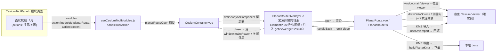

# 方案：面状航线模块迁移并融入 CesiumToolPanel（L3）

> 状态：**待批准**（未批准前不施工）
> 日期：2026-08-20
> 提出：AI Agent（本次会话）
> 涉及：`frontend/src/domains/cesium/modules/planar-route/`（新增集成层）、`useCesiumToolModules.js`、`CesiumContainer.vue`、`package.json`、`vite.config.js`、`cesium.d.ts`、i18n、结构树文档

---

## 1. 现状与问题

### 1.1 用户已完成的部分
源项目 `D:\Dev\GitHub\planar-wayline`（独立 Vite 工程，面状航线规划工具）的模块文件已被复制到目标项目
`frontend/src/domains/cesium/modules/planar-route/`（约 40 个文件，git 已 staged），并做了少量格式化适配。

### 1.2 迁移未完成的部分（本次任务范围）
| # | 缺口 | 影响 |
|---|------|------|
| 1 | **依赖缺失**：`element-plus` / `@element-plus/icons-vue` / `@turf/turf` / `@cesium-extends/subscriber` / `gsap` 均不在目标 `package.json`，`node_modules` 亦未安装 | 模块全部 .ts / .vue 无法编译运行 |
| 2 | **`@/utils/BaseInstance` 不存在**：模块 5 个组件类 extends 它（用 `utilities.downloadBlobFile`、`router?.back()`） | 编译报错 |
| 3 | **`@/utils/CesiumMap`（initMap）不存在**：模块 `CesiumMap.ts` 依赖它在自己 DOM 里新建独立 Viewer | 编译报错；且与目标项目「单 Viewer、CDN 单实例」架构冲突 |
| 4 | **Cesium 导入方式不兼容**：模块 15 个文件用 `import * as Cesium from 'cesium'`，但目标项目通过 `cesium-shim.js` 把 `cesium` 映射为 CDN 全局（仅具名导出 + 默认 Proxy）。`Cesium.Viewer` 等成员经 `import *` 访问会得到 `undefined` | 运行时崩溃 |
| 5 | **`window.mainViewer` / `window.miniViewer` 无类型声明**（模块内 47 处使用） | tsc 报错 |
| 6 | **未接入 toolPanel**：`useCesiumToolModules.js` 无对应模块定义、无 action 分发、`CesiumContainer.vue` 无渲染入口 | 功能不可达 |

### 1.3 目标项目关键约束（已核实）
- Cesium 走 **CDN 单实例**（`cesium-shim.js` + `cesium.d.ts`），`vite.config.js` 显式 `exclude: ['cesium']` 防双实例 → **禁止在模块内再 `new Cesium.Viewer`**。
- 3D 容器 `CesiumContainer.vue` 持有唯一 Viewer，经 `getViewer()` / `getCesium()` 注入（模块范式见 `Docs/Guide/handover.md` §4.3）。
- 工具模块范式：模块工厂返回 `{ id, title, description, status, statusTone, actions, controls }`，在 `useCesiumToolModules.js` 注册 + `handleToolAction` / `handleToolControlChange` 分发，面板自动渲染。
- 新增 `.ts` 须过 `tsc --noEmit`；文件增删须同步 `frontend-structure.md`；门禁 `CheckStructureTree.py` / `CheckConfigRegistry.py` 必过。

---

## 2. 目标与验收标准

**目标**：面状航线（测区绘制 / 弓字形航线生成 / 五向倾斜 / 仿地 / KMZ 导入导出）作为 CesiumToolPanel「模块」页签下的一个卡片模块，点击「打开」在全屏浮层中编辑，复用宿主 Viewer，不引入第二个 Cesium 实例。

**验收**：
- [ ] toolPanel「模块」页签出现「面状航线」卡片，展开有「打开面状航线编辑器」按钮。
- [ ] 点击后全屏浮层打开，宿主球体作为地图底图，左侧配置面板、顶部保存/导入栏正常。
- [ ] 测区绘制、顶点拖拽、右键删除、自相交提示、航线生成、五向切换、KMZ 导出/导入可用。
- [ ] 关闭浮层后宿主场景（底图 / 已导入数据 / 相机）不受污染，无残留实体、无事件泄漏。
- [ ] `npx tsc --noEmit` 无本任务新增报错；`CheckStructureTree.py` / `CheckConfigRegistry.py` 通过。
- [ ] 门禁 + 构建通过，Element Plus / Turf 等新依赖被独立分包（不撑爆 vendor-libs / 首屏）。

---

## 3. 方案对比与选型

### 3.1 Viewer 归属（关键决策）
| 方案 | 说明 | 优 | 劣 | 结论 |
|---|---|---|---|---|
| **A. 共享宿主 Viewer（推荐）** | 浮层透明地图区 + 宿主球作底图，模块 `CesiumMap.ts` 改为注入并发射宿主 viewer，`window.mainViewer = getViewer()` | 无双实例风险、内存省、底图/地形/图层直接复用；与项目单实例架构一致 | 需适配几处「建独立球」的代码；浮层需处理 z-index 与宿主 UI 遮挡 | ✅ **选此** |
| B. 独立 Viewer | 浮层内 `initMap` 建第二个球 | 改动小、与源工程最贴近 | 双 WebGL 上下文 + 双地形加载（重）；违背项目「防 Cesium 双实例」设计 | 否 |

### 3.2 UI 框架（Element Plus）
| 方案 | 说明 | 结论 |
|---|---|---|
| **A. 新增 element-plus 依赖 + 按需注册（推荐）** | 模块 4 个 Vue 组件 + ElMessage/ElMessageBox 强依赖 el-* 组件；在懒加载入口按需 `app.component()` 注册所用组件与图标（tree-shaking 只打包用到的），CSS 随懒加载 chunk 进入 | ✅ **选此**（重写 UI 到 lil-gui 属伤筋动骨，且源工程即 Element Plus 技术栈） |
| B. 重写 UI 为 lil-gui/原生 | 避免新增依赖 | 工作量大、丢失现有交互（滑块/上传/表单校验/弹窗）；不现实 | 否 |

### 3.3 依赖新增清单（均与源工程版本对齐）
```
element-plus ^2.9.7            （运行时依赖）
@element-plus/icons-vue ^2.3.1
@turf/turf ^7.2.0
@cesium-extends/subscriber ^1.1.1
gsap ^3.13.0
```
> `jszip`（KMZ 打包）目标项目已有；`mitt` 已在 node_modules（bus 备用）。不新增任何配置 key → 不影响 `.env.example` / `catalog.py` / 门禁配置项。

### 3.4 Cesium 导入适配
- `src/cesium.d.ts` 增加一行 `export default any;`（对应 shim 的真实默认导出 Proxy）。
- 模块内 15 个 `import * as Cesium from 'cesium'` 全部改为 `import Cesium from 'cesium'`，成员访问均走默认 Proxy（运行时正确）且类型退化为 `any`（与项目现状一致）。

### 3.5 模块集成结构


---

## 4. 实施步骤

1. **依赖安装**：`package.json` 增加 5 个依赖并 `npm install`（需用户批准，安装命令由用户执行或批准后由我执行）。
2. **类型与 Cesium 适配**
   - `src/cesium.d.ts` 加 `export default any;`
   - 15 个文件 `import * as Cesium` → `import Cesium`
   - 新增 `modules/planar-route/global.d.ts`：声明 `window.mainViewer` / `window.miniViewer`
3. **本地 BaseInstance**：新建 `modules/planar-route/utils/baseInstance.ts`（`utilities.downloadBlobFile` / `message` 包装 / `bus` / `router=null`），替换 5 处 `@/utils/BaseInstance` 引用。
4. **Viewer 注入**：
   - `CesiumMap.ts`：改为接收 `getViewer` prop，`onMounted` 直接发射宿主 viewer（删除 `initMap` 调用）。
   - `PlanarRoute.ts`：`loadMainMap` 保持设置 `window.mainViewer`；新增 `embedded` 处理 `handleBack` 改为 `emit('close')`。
   - `PlanarRoute.vue`：加 `embedded` 样式分支（页面背景透明，露出宿主球），`handleBack` 由顶部返回箭头触发。
5. **模块定义与运行时分发**：
   - 新建 `modules/planar-route/planarRouteModule.js`：`createPlanarRouteModule(planarRouteOpen)` → `{ id:'planarRoute', title, description, status, statusTone, actions:[{id:'open'}] }`。
   - `useCesiumToolModules.js`：新增 `planarRouteOpen` ref、注册模块、`handleToolAction` 加 `planarRoute.open` 分支；返回 `planarRouteOpen`。
   - 新建 `modules/planar-route/PlanarRouteOverlay.vue`（懒加载入口：按需注册 ElementPlus 组件/图标 + 渲染 PlanarRoute + 注入 viewer + 关闭清理）。
6. **容器接线**：`CesiumContainer.vue` 渲染浮层、打开时收起 toolPanel 并隐藏坐标浮层、关闭时清理 `window.mainViewer`。
7. **i18n**：`zh-CN.js` / `en-US.js` 增加 `cesium.module.planarRoute.*` 键。
8. **分包**：`vite.config.js` `manualChunks` 增加 `vendor-element-plus` / `vendor-turf` / `vendor-cesium-extends` / `vendor-gsap`，并加入 `SKIP_PRELOAD_CHUNKS`。
9. **文档与门禁**：更新 `frontend-structure.md`；README 三处版本号 → V3.5.24；CHANGELOG 追加条目；创建 `Docs/LLM_record/26-08/2026-08-20/` 维护日志；跑两个门禁脚本 + `npx tsc --noEmit`。

---

## 5. 风险与兼容性

- **Element Plus 全局样式污染**：`element-plus/dist/index.css` 定义通用变量（`--el-*`）。模块内组件本就依赖这些变量，注入后对宿主 UI 影响有限（宿主不用 el-* 组件）；浮层样式 scoped，冲突面小。若担心，可在浮层外层加类名 + CSS 变量作用域隔离。
- **`window.mainViewer` 全局占用**：打开时赋值、关闭时清空；若关闭前宿主已有同键全局，先保存后还原。
- **浮层 z-index**：用 `--z-overlay-top: 2400` 压过模态，低于 `--z-toast`。
- **CDN Cesium 版本**：源工程用 cesium 1.135，目标 CDN 候选含 1.132+；`Terrain.fromWorldTerrain` / `sampleTerrainMostDetailed` 等 API 两版本均具备（⚠️ 待实机验证，差异如有以实机为准）。
- **仿地（AGL）依赖宿主地形**：宿主未开地形时 AGL 模式无法采样，ASL / 相对起飞点模式不受影响（与源工程一致，源工程也依赖世界地形）。

---

## 6. 待用户确认（批准项）

1. 批准新增上述 **5 个 npm 依赖**（element-plus 为最大项，按需引入 + 独立分包）。
2. 批准 **共享宿主 Viewer**（方案 3.1-A）与 **Element Plus 按需注册**（3.2-A）技术路线。
3. 批准 `vite.config.js` 分包调整（第 4 步 8）。
4. 确认版本号 `V3.5.24` 与任务等级 L3。

---

*本方案待批准。批准后按第 4 节顺序施工，施工后输出交接块。*