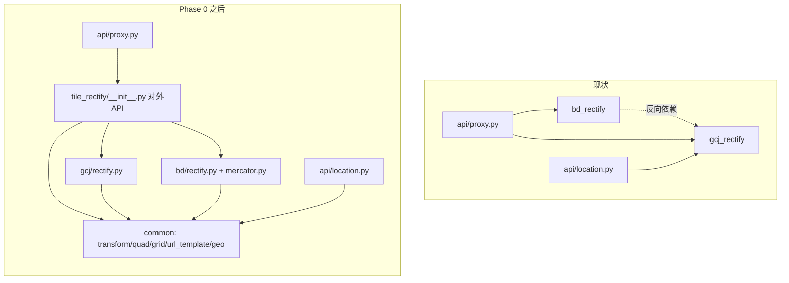
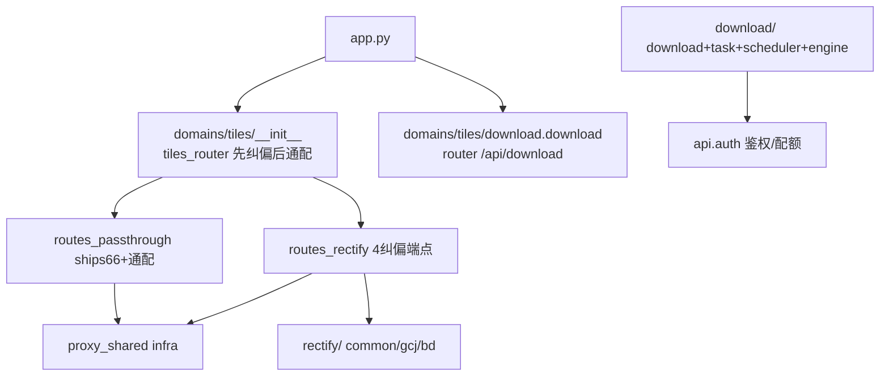

# 后端代码组织重构方案（L3）

- **日期**：2026-09-03
- **任务等级**：L3（跨模块目录调整；方案先行，用户已批准按此逐步执行）
- **批准依据**：Force_command §0 优先级 1——用户在当前会话明确指令"就按照你的方案来……逐步执行"。
- **范围**：`backend/` 包结构；不碰前端、不碰部署清单、不新增配置 key、不迁移运行时数据。

---

## 1. 问题分析（症状 → 根因 → 受影响模块 → 候选方案）

**核心症状**：改一个"瓦片"需求要同时摸 5 个地方
（`api/proxy.py`、`api/external_proxy.py`、`download_xyz/`、`bd|gcj_rectify/`、`utils/http_headers.py`），
而前端同类需求收拢在 `domains/` 一处。

**根本原因**：后端按**技术层**组织（`api/` 平铺 15 个路由、`services/` 仅 2 文件且与路由职责重叠、
`utils/` 大杂烩、`download_xyz/` 孤岛），前端按**业务域**组织（`domains/{ol,cesium,common}`）。
`bd_rectify` 反向 import `gcj_rectify`（包依赖方向歪）；`CoordinateRectify/` 只剩无源 pycache（历史改名尝试的残留）；
前端注释指向不存在的 `backend/CoordinateRectify/bd/`（悬空引用）。

**受影响模块**：`backend/{bd_rectify,gcj_rectify,api/proxy.py,api/location.py,tests/test_url_template.py}`、
`frontend/.../basemapConfig.ts`（1 行注释）、`Docs/Guide/backend-structure.md`（结构树）。

**候选方案对比**：

| 方案 | 说明 | 结论 |
|---|---|---|
| A. 只合并 rectify（父包 + bd/gcj/common 三子包） | 改动面 5 文件，依赖变单向，解决当前最痛 | ✅ Phase 0 采用 |
| B. 一步到位 domains 化 | 一次改 ~30 文件，HF 回滚面大 | ❌ 风险过高，拆分期 |
| C. 维持现状只加文档 | 零风险零收益 | ❌ 用户已否决 |

---

## 2. 目标结构（Phase 0 本期只做 tile_rectify 部分）

Phase 0 文件映射（移动 + 小改）：

| 现路径 | 新路径 | 改动 |
|---|---|---|
| `gcj_rectify/transform.py` | `tile_rectify/common/transform.py` | 纯移动（6 个纯数学函数，双向共用） |
| `gcj_rectify/url_template.py` | `tile_rectify/common/url_template.py` | 纯移动（与坐标系无关） |
| `gcj_rectify/fetch.py` | `tile_rectify/common/fetch.py` | 纯移动 |
| `gcj_rectify/utils.py` | `tile_rectify/common/geo.py` | 整体搬入（含 `get_cache_dir`，默认缓存目录值 `data/gcj_rectify_cache` 不变，不迁移数据） |
| `gcj_rectify/rectify.py` | `tile_rectify/gcj/rectify.py` | 改 import + 输出分类名不变（`*2` 已升版） |
| `bd_rectify/{rectify,mercator}.py` | `tile_rectify/bd/` | 改 import |
| `api/proxy.py`、`api/location.py`、`tests/test_url_template.py` | 原位 | 仅改 import 行 |
| `basemapConfig.ts:1405` 注释 | 原位 | `CoordinateRectify/bd/` → `tile_rectify/bd/` |
| `CoordinateRectify/**/__pycache__` | 删除 | 无源 pycache 残留（git 未追踪），顺带清理 |

依赖铁律：`bd → common ← gcj`，common 禁止 import 兄弟包。

后续分期：Phase 1 瓦片域收拢（本方案 §4，已执行）、Phase 2 部分执行
（`utils/` → `core/` 原样下沉 + tests 瓦片分组）。

**`config/` 搬迁取消（V3.5.43 决议，不再递延）**：① `config` 被 auth/agent_chat/services/app
等 24 处 import，churn 面大；② `CheckConfigRegistry.py` 门禁与 `configuration.md` /
`dev-conventions.md` / `handover.md` / `configuration-three-tier.md` 等 17 处文档把
`backend/config` 写定为 canonical 路径（含 Force_command SSOT 表，改它需另行批准）；
③ `config/runtime.py` 本就反向依赖 `api.auth`，搬进 `core/` 反而坐实倒置分层。
`config` 作为干净小包留在顶层是当前最优解，重构到此结束。

---

## 4. Phase 1 细化（已执行，V3.5.41）

目标：`backend/domains/tiles/` 瓦片域收拢 HTTP 层 + 下载 + 底座库。

文件映射：`api/proxy.py` 按节注释字节级拆分为
`proxy_shared.py`（infra）+ `routes_rectify.py`（4 端点 + `_resolve_gcj_*`）+
`routes_passthrough.py`（ships66 + 通配），函数体经 AST 校验逐字一致；
`download_xyz/` → `download/`、`tile_rectify/` → `rectify/` 纯移动；
`api/proxy.py`、顶层 `download_xyz/`、`tile_rectify/` 删除（无 shim，同仓原子发布）。

不变量：URL 零变化；`app.py` 挂载顺序不变（keepalive → tiles → external → … → download）；
`tiles_router` 内纠偏先于通配（`tests/test_tiles_router.py` 回归锁定）。
`download/` 重依赖（sqlmodel/rasterio/apscheduler）不进 `domains/tiles/__init__` 聚合，
`app.py` 单独按原位置挂载，避免轻量调用方被拖入。
`external_proxy.py`（高德/Nominatim/EPSG/IP 的 JSON/文本代理）不是瓦片，保持不动。

---

## 3. 风险与回滚

- Docker 整目录 COPY，无逐包路径耦合；`data/` 运行时路径不变（`get_cache_dir` 原样保留）。
- Python 包全小写，符合规范；`__init__.py` 暴露旧函数名，调用方只改 import 前缀。
- 不设旧包名 shim（同仓前后端同发，不存在跨版本混用；旧名仅存活 1 天，无外部消费者）。
- 回滚 = 换 Docker 镜像 tag（HF），本地回滚 = 用户 `git checkout -- backend`（Agent 禁止执行 Git 写操作）。
- 门禁：`pytest` + `CheckStructureTree.py` + `CheckConfigRegistry.py`（无新增配置项，后者应零变化通过）。
