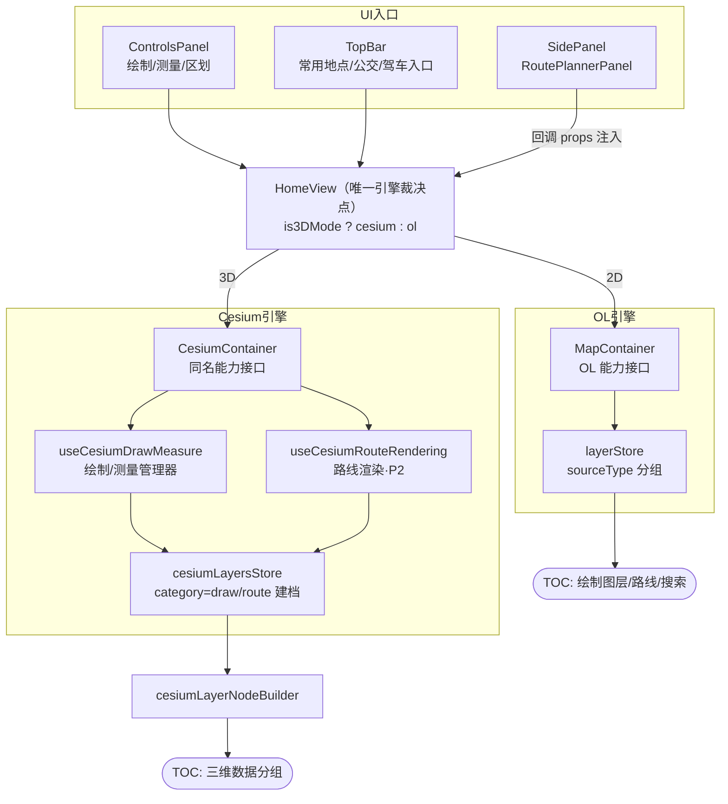

# 地图操作引擎感知化迁移方案（Engine-Aware Map Operations Migration Plan）

> **任务等级**：L3（跨模块重构 · 架构约定确立）
> **提出背景**：双引擎架构下，绘制/测量、公交规划、驾车规划、常用地点等历史功能未判断当前地图引擎，一律无条件路由到 OL；3D 模式下表现为静默失效或误投隐藏画布。本方案确立「**所有地图操作首先判断引擎，再路由到对应引擎完成数据注册与 TOC 管理**」的强制约定，并分批迁移存量。
> **状态**：已实施（P0+P1+P2 随 **V3.5.32** 于 2026-08-27 落地，用户批准执行）；§3 分批计划中 P3 盲区收尾另行立项。裁决结论：绘制/路线进「三维数据」分组（category='draw'|'route'，TOC format 标签区分绘制/路线/影像/地形）。
> 关联：`Docs/LLM_record/26-08/2026-08-26/2026-08-26-cesium-draw-measure-engine-routing.md`（P0 批次任务日志）

---

## 1. 现状审计（引擎盲区清单）

以下地图操作在 `HomeView.vue` 中无条件调用 `mapContainerRef`（OL），3D 模式下作用于被 v-show 隐藏的 2D 画布：

| # | 功能 | 入口 → 落点 | 位置 | 严重度 |
|---|---|---|---|---|
| 1 | 绘制/测量激活（点/线/面/测距/测面/高级图形） | ControlsPanel `map-interaction` → `mapContainerRef.activateInteraction` | HomeView.vue:519（仅 ReverseGeocodePick:509 有引擎分支） | 高 |
| 2 | 绘制样式变更 | `handleControlsDrawStyleChange` → `updateDrawingStyleParams` | HomeView.vue:527 | 中 |
| 3 | 绘制编辑动作（删除选中/撤销上个） | `handleControlsDrawEditAction` | HomeView.vue:536,540 | 中 |
| 4 | 公交起点/终点选点 | SidePanel(RoutePlannerPanel 回调) ← `startBusPointPick` → `mapContainerRef.startBusPointPick` | HomeView.vue:394 | 高 |
| 5 | 公交路线渲染/步骤定位/步骤预览/清理 ×4 | `drawRouteOnMap` / `zoomToBusRouteStep` / `previewBusRouteStep` / `clearBusRouteStepPreview` | HomeView.vue:398-411 | 高 |
| 6 | 驾车路线渲染/步骤定位/步骤预览/清理 ×4 | `drawDriveRouteOnMap` / `zoomToDriveRouteStep` / `previewDriveRouteStep` / `clearDriveRouteStepPreview` | HomeView.vue:414-427 | 高 |
| 7 | 常用地点跳转 | TopBar `jump-view`(lng,lat,z,l) → `handleTopBarJumpView` → `updateViewByParams`（z 为 OL 缩放级别语义） | TopBar.vue:488 → HomeView.vue:1429 | 高 |
| 8 | 左栏 ControlsPanel 整体 | 无任何引擎门控，3D 下全部按钮可见可点 | HomeView.vue:1661（模板无条件渲染） | 结构性 |

**连带盲区**（本次列册，默认不在本方案批次内，见 §6 P3）：
- 行政区划选择/显隐/移除（`handleDistrictLayer*` 系列，OL 专属图层）
- 卷帘对比（enable-basemap-swipe）、空间分析（spatial-analysis）
- 搜索 POI 结果标记（`useMapSearchAndCoordinateInput.js:197/479`，sourceType='search' 直建 OL 要素）
- 罗盘面板地理定位后的视角联动（`getMapUserLocation`，HomeView.vue:390）

**路线结果现状**：公交/驾车渲染层 `useRouteRendering.js` 以 `sourceType:'search' + metadata.category('bus'/'drive')` 建档进 userDataLayers → TOC「搜索图层」分组（useLayerStore.ts:58-71 按 `category==='route' || /_route$/` 二次分流到 folder-route）。

## 2. 目标架构约定（强制）

### 2.1 引擎裁决单点
`HomeView` 是唯一引擎裁决点。所有地图操作 handler 必须先经 `is3DMode` 分流，再调用对应容器暴露的**同名能力接口**；禁止绕过 HomeView 直连任一引擎。

### 2.2 能力接口与降级
两引擎容器 expose 同名方法（如 `activateInteraction` / `drawRouteOnMap` / `jumpToViewState`）。引擎不支持的能力**必须显式返回 false/null**，由 HomeView 统一 toast 提示降级——禁止静默丢弃（规范 §2-8）。

### 2.3 数据注册与 TOC 管理（双轨）
| 引擎 | 注册路径 | TOC 呈现 | 生命周期 |
|---|---|---|---|
| OL | managedLayerRecord(sourceType) → user-layers-change → layerStore.syncLayers | folder-draw / folder-route / folder-search | 跟随图层移除 |
| Cesium | `cesiumLayersStore.registerDrawing/registerRoute`（`category:'draw'\|'route'`）→ cesiumLayerNodeBuilder | 「三维数据」分组（format 标签区分 绘制/路线/数据） | 跟随 CesiumContainer 卸载即清档（既有语义） |

### 2.4 架构图

## 3. 分批实施计划

### P0 绘制/测量引擎化（本期随本方案一并实施）
- 新增 `cesium/composables/draw/useCesiumDrawMeasure.js`：ScreenSpaceEventHandler 单例交互（左击加点 / 移动预览 / 双击·右击结束）；取点链 `scene.pickPosition → camera.pickEllipsoid`；测距用 EllipsoidGeodesic 表面距离（对齐 OL 水平距离语义），测面用 ENU 投影 shoelace；成品实体贴地（point heightReference/polyline clampToGround/地面多边形）+ 测量结果标签；内存句柄表支撑显隐/透明度/flyTo/移除/撤销/清空。
- `cesiumLayers.ts`：record 增加 `category:'data'|'draw'`；`registerDrawing` 动作；syncFromImport 修剪豁免 draw 记录；remove 对 draw 类即时删档。
- `cesiumLayerNodeBuilder.ts`：`draw` 类型标签「绘制」，sourceType 区分。
- `CesiumContainer.vue`：实例化管理器；adapter 五操作先查绘制句柄再回落导入数据；expose `activateCesiumInteraction / updateCesiumDrawingStyle`；卸载与 viewer 重建时清理。
- `HomeView.vue`：三个 handler 引擎分支（交互/样式/编辑动作）；3D 未支持类型（高级图形/SelectEdit）toast 明示。
- i18n：`cesium.interaction3dUnsupported`、`cesium.draw3dNoSelectionDelete` 中英双语。

### P1 常用地点引擎化（本期一并实施，改动最小）
- `handleTopBarJumpView` 引擎分支：3D 下用 **V3.5.31 canonical 尺度系统**把 OL `z`（缩放级别）换算为 Cesium 相机高度（`olZoomToCesiumHeight({zoom, centerLat, viewport})`），`lng/lat` 直接定位；`l` 底图索引同步 Cesium `activeBasemap`（存在对应预设时）。
- 纯视口跳转，无 TOC 注册需求。

### P2 公交/驾车规划引擎化（本期实施，工作量主体）
- **API 管线零改动**：天地图请求/解析位于 RoutePlannerPanel（引擎无关数据层）。
- 新增 `cesium/composables/draw/useCesiumRouteRendering.js`：实现与 OL 侧同签名的 8 个回调（公交 4 + 驾车 4）：
  - `startBusPointPick(type)`：复用 P0 取点交互基础设施，起终点 billboard 标注；
  - `drawRouteOnMap(route)` / `drawDriveRouteOnMap(payload)`：分段贴地 polyline（步行段虚线、公交段实线配色对齐 mapStyles.js 既有视觉）+ 站点 billboard；
  - `zoomToXxxRouteStep / previewXxxRouteStep / clearXxxStepPreview`：BoundingSphere 定位与高亮切换。
- 建档：`cesiumLayersStore.registerRoute`（category='route'，name 区分 公交/驾车 方案），进「三维数据」分组，format 标签「路线」；支持显隐/透明度/移除/定位。
- `SidePanel.vue` 或 `HomeView.vue`：9 个桥接函数按引擎注入对应实现（RoutePlannerPanel 本身零改动）。

### P3 盲区收尾（另立任务，另行批准）
行政区划、卷帘、空间分析、搜索 POI 标记、罗盘联动、ControlsPanel 3D 门控 UI（隐藏不支持按钮 vs 提示降级的交互裁决）。

## 4. 版本与交付物
- 本次 L3 整体交付为 **V3.5.32**（含 P0+P1+P2）。
- 交付物：上述代码文件 + dev-conventions.md「强制规范」摘要增补引擎裁决条款 + frontend-structure.md 结构树 + CHANGELOG/README 三处版本号 + LLM_record 日志（含 Mermaid 与测试方案两栏）。

## 5. 风险与非目标
- **风险**：① 长路线 clampToGround 地面图元的绘制开销（按需渲染管理器已有 acquire/release 机制可挂接）；② 步骤预览状态在双引擎间的一致性（切引擎时清理两侧临时态）；③ 极小 zoom（z<3）的高度换算视觉合理性（canonical 系统已验证往返恒等）。
- **非目标**：不做 3D 高级图形（军标/箭头族）；不改天地图 API 层；不动后端；不迁移行政区划等 P3 项。

## 6. 批准请求
请裁决：① 是否批准 P0+P1+P2 作为 V3.5.32 一并实施；② 或缩减范围（如仅 P0+P1）；③ Cesium 路线/绘制入「三维数据」分组（format 标签区分）是否符合预期，或需独立顶层分组。
