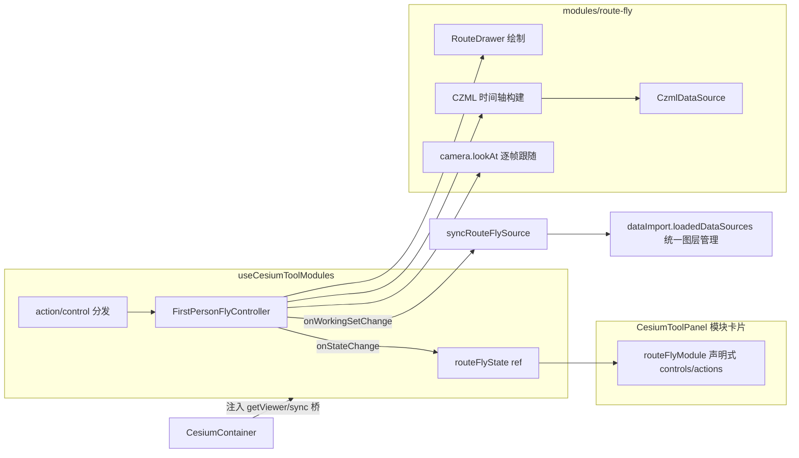

# L3 方案：路线漫游模块（RouteFly）——绘制贴地线路 + 第一/第三人称相机动画

> 状态：**待用户批准**（Force_command.md §1 L3：批准前禁止施工）
> 参考 Demo：`Docs/Demo/first_person_fly.html`（迁移 + 针对本项目优化，非照搬）

## 一、目标与范围

用户在 Cesium 场景中手绘一条线路（左键加点/右键结束）→ 线路加入统一图层管理 → 相机沿线路从起点到终点做漫游动画，支持第一人称（distance≈0、隐藏模型）与第三人称（跟随距离 + 俯仰）两种视角，参数经 lil-gui 声明式控件配置，接入 CesiumToolPanel 模块卡片体系。

**不做**：KMZ 导入导出（planarRoute 已有）、速度坡度曲线编辑（后续迭代）。

## 二、与 Demo 的关键差异（本项目优化点）

| # | Demo 做法 | 本项目做法 | 原因 |
|---|---|---|---|
| 1 | 绘制预览与最终线都不用 clampToGround（白模场景无地形） | **预览期直连虚线；右键结束后最终路线 `clampToGround: true` 贴地** | 项目默认开地形，贴地折线才是需求本体；但 CallbackProperty 逐帧变位 + clampToGround 会让 GroundPolylinePrimitive 每帧重建掉帧——所以只在**位置冻结后**启用贴地 |
| 2 | 高度采样：`scene.sampleHeight`（含建筑）+ `globe.getHeight` 回退 | 保留该双通道开关「贴合建筑表面」；另增 `sampleTerrainMostDetailed` 异步精确地形采样路径（地形开启时的首选，无离屏渲染代价） | 地形开启后 `globe.getHeight` 在瓦片未就绪时返回 undefined，异步采样更稳 |
| 3 | 模型 `./data/drone.glb` 相对路径 | 模型 URI 进模块控件（text），默认指向项目 public 下资源；缺失时自动降级为纯相机漫游（showModel=false） | 宿主项目无 baimo/drone 资源 |
| 4 | 单文件 Vue Demo | 无头控制器 + 模块卡片声明 + useCesiumToolModules 注册（复刻 planarRoute 范式） | toolModules 既有架构约定 |
| 5 | 无图层管理 | 工作集桥接进统一图层管理（type 复用 `'wayline'` 分支） | 用户明确要求"加入到图层管理" |
| 6 | — | 保留 Demo 已修正的四个坑：①不设 trackedEntity（与 lookAt 抢相机）；②`heading ?? 0` 替代 `||90` 优先级 bug；③orientation CallbackProperty 只改实体朝向不动原始四元数；④clock.multiplier 承载速度（时间=累积距离，改滑块即时生效） | 这些是 Demo 里已踩平的坑 |

## 三、架构设计（新增 2 文件 + 修改 3 文件）

### 新增

**① `frontend/src/domains/cesium/modules/route-fly/firstPersonFlyController.js`**
无头控制器类 `FirstPersonFlyController`，合并 Demo 的 RouteDrawer + FirstPersonFly + 重采样/CZML 构建：

```
class FirstPersonFlyController {
  constructor({ getViewer, getCesium, onStateChange, onWorkingSetChange })
  bind(viewer)
  // 绘制
  startDrawing() / cancelDrawing()
  // 规划
  buildFlight()            // 重采样+表面采样+CZML 时间轴（内部）
  startFly() / stop() / suspend() / speedUp() / speedDown() / clean()
  // 参数 setter（lil-gui onChange 直驱）
  setSpeed/setDistance/setHeading/setPitch/setFlyHeight/
  setPathShow/setModelShow/setModelScale/setModelHeadingOffset/
  applyViewPreset('first'|'third') / setTrack(enabled)
  setSampleStep / setClampToBuildings / setModelUri
  destroy()
}
```

对宿主暴露的状态（onStateChange patch）：`isDrawing / pointCount / hasRoute / isFlying / isPaused / multiplier / routeLengthText / durationText / viewMode('first'|'third'|'free')`。

工作集上报（onWorkingSetChange）：`{ present, name, dataSource }` → CesiumContainer 写入 `loadedDataSources`（id=`ROUTE_FLY_SOURCE_ID`，type=`'wayline'`，managedByModule=true），复用现有 wayline 删除分支（外部删除前调 `detachForExternalRemoval()`）。

**② `frontend/src/domains/cesium/composables/toolModules/routeFlyModule.js`**
`createRouteFlyModule(state)` → 模块卡片 `{ id:'routeFly', title, description(航点数/总长/时长实时统计), status/statusTone, actions[], controls[] }`

actions：`drawRoute`（绘制/取消）、`startFly`、`suspend`、`speedUp`、`speedDown`、`stop`、`clearAll`
controls：
| id | 类型 | 说明 |
|---|---|---|
| viewPreset | select | 第一人称/第三人称（应用预设并写回 distance/pitch/showModel） |
| track | checkbox | 相机锁定（关=自由观察，实体继续飞） |
| distance / heading / pitch | range | 跟随距离/偏航/俯仰（第三人称调参） |
| flyHeight | range | 离地高度（运行时 delta 偏移，不重建 CZML） |
| speed | range | 倍速（clock.multiplier） |
| sampleStep | range | 表面采样间距 m |
| clampToBuildings | checkbox | 贴合建筑表面（sampleHeight vs 地形采样） |
| modelUri | text | 模型地址 |
| showModel / modelScale / modelHeadingOffset | 组 | 模型三件套 |
| showPath / showMarkers | checkbox | 路径/航点显隐 |

### 修改

③ **`useCesiumToolModules.js`**：`routeFlyState` ref + `ensureRouteFlyController()`（动态 import 懒加载 chunk，模式同 planarRoute）+ `toolModules[]` 追加卡片 + `handleToolAction/handleToolControlChange` 各加 `routeFly` 分支 + `cleanupTools()` 销毁 + 导出 `detachRouteFlyWorkingSet`。

④ **`CesiumContainer.vue`**：注入 `syncRouteFlySource`（复制 syncPlanarSourceRecord 模式，`ROUTE_FLY_SOURCE_ID='cesium-route-fly'`）+ 外部删除 wayline 分支追加 `detachRouteFlyWorkingSet?.()`。

⑤ **i18n 语言包**：`cesium.module.routeFly.*` 键（zh/en）。

### Mermaid（数据流）



## 四、关键技术决策

1. **clampToGround 双阶段策略**（响应用户核心诉求）：预览直连防掉帧 → 定稿贴地。飞行轨迹高度不走 clampToGround entity，而走「表面采样 + flyHeight 离地」的 CZML 数值路径——相机/模型位置才能被插值器平滑驱动。
2. **地形采样优先级**：`clampToBuildings=true → scene.sampleHeight`（含 3D Tiles，同步但有离屏渲染成本）；否则 `sampleTerrainMostDetailed`（异步批量，地形精确）；两者失败回退两端高程线性插值。
3. **相机控制权**：跟随期间 `camera.lookAt` 锁定，停止/暂停自由观察时必须 `lookAtTransform(IDENTITY)` 解锁（Demo 已验证的坑）。
4. **时钟卫生**：进入模块接管 clock（shouldAnimate/multiplier/currentTime），`clean()/destroy()` 必须恢复 multiplier=1 并移除 dataSource，防止污染其他时间轴功能（player/planarRoute 同理）。
5. **懒加载**：控制器 chunk 仅在首次交互时 import，不加重首屏。

## 五、测试方案（实机）

- 开地形绘制跨山线路 → 定稿线贴山体起伏；开启建筑贴合在城市白模上绘制 → 飞行不穿楼
- 第一人称（distance=0.1/pitch=0/隐藏模型）与第三人称预设切换即时生效
- 速度滑块倍速即时生效；暂停/继续/停止后鼠标操作恢复正常
- 图层管理出现路线条目，面板外删除该条目后再绘制不残留实体
- 中途切语言、销毁面板重进，无 clock/entity 泄漏

## 六、风险

- `sampleTerrainMostDetailed` 在自定义地形提供者下的可用性需实机确认（⚠️ 未验证）
- 长线路（数千采样点）LAGRANGE 插值 CPU 成本——采样间距上限 200m 兜底
- 与 playerModule 同时激活时的 clock 争用：约定互斥（启动一方先 stop 另一方，实施时加守卫）
